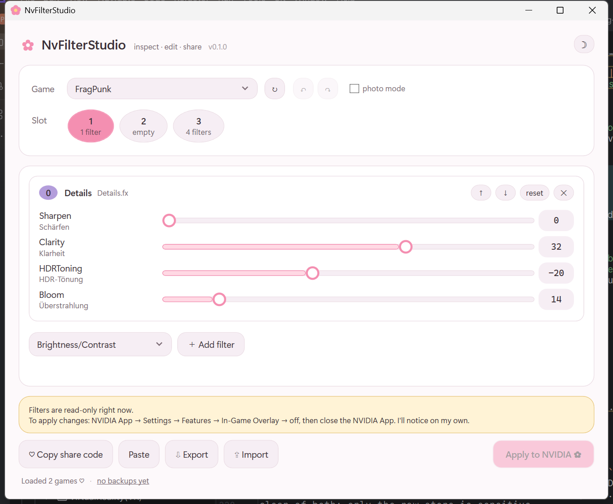
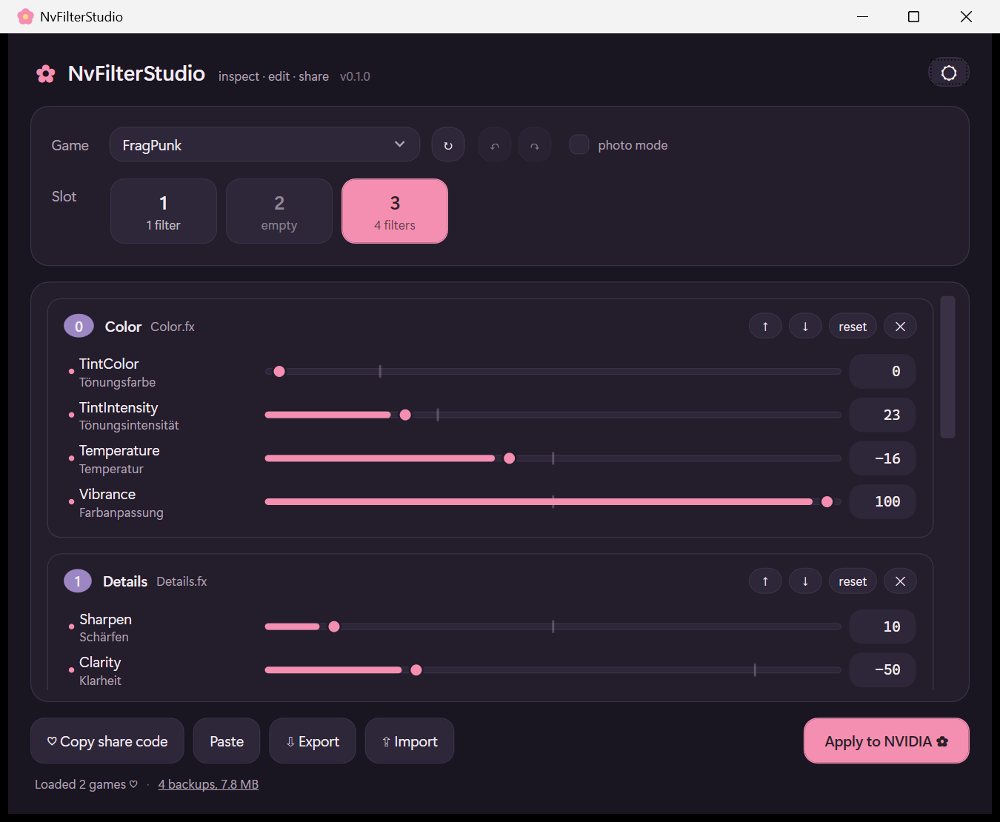

# ✿ NvFilterStudio

[](https://github.com/6uhrmittag/NvFilterStudio/actions/workflows/ci.yml)
[](LICENSE)
[](https://github.com/6uhrmittag/NvFilterStudio/releases/latest)

Back up, edit and share your **NVIDIA game filters**.

The NVIDIA App has no export or import for game filter (Freestyle) presets, and
a driver update can wipe them. Tune a look you love, lose it, and there is no
way to get it back — or to send it to a friend. This fixes that.

> ⚠️ **Not affiliated with NVIDIA.** Independent tool, MIT licensed.

| Light | Dark |
|---|---|
|  |  |

## What it does

- 🔍 **Inspect** every filter slot for every game, with real values
- 🎚️ **Edit** sliders, reorder the stack, add and remove filters
- 💾 **Export** a profile to a JSON file
- 💌 **Share** a profile as a short code you can paste into Discord
- ↩️ **Back up** automatically before every write

## Getting started

Download `NvFilterStudio.exe` from the
[latest release](https://github.com/6uhrmittag/NvFilterStudio/releases/latest)
and run it. No installer, nothing to configure, and .NET is bundled — which is
why it is around 60 MB.

> **Windows will warn you the first time.** The download is not code-signed, so
> SmartScreen shows "Windows protected your PC". Choose **More info → Run
> anyway**. Signing needs a paid certificate; until then you can build it
> yourself with `dotnet build` and see exactly what you are running.

It follows your Windows light/dark setting, and the ☾ button in the corner
switches manually.

### Before you can apply changes

Reading works any time — while gaming, with everything running. **Writing needs
the overlay switched off**, because the NVIDIA Overlay holds the settings
database open and anything written underneath it is discarded.

1. **NVIDIA App → Settings → Features → In-Game Overlay → off**
2. Close the NVIDIA App
3. Apply your changes in NvFilterStudio
4. Turn the overlay back on

The app watches for this and enables **Apply** on its own once the way is clear.

> Closing the NVIDIA App alone is not enough — the `NvContainerLocalSystem`
> service restarts the overlay within seconds. The setting toggle is what
> actually releases it.

## Keyboard

| | |
|---|---|
| `Ctrl+S` | Apply to NVIDIA |
| `Ctrl+R` | Re-read from NVIDIA |
| `Ctrl+E` | Export to a file |
| `Ctrl+Shift+C` / `Ctrl+Shift+V` | Copy / paste a share code |

Start with `--theme light` or `--theme dark` to override the Windows setting.

## Sharing

Two formats, for two different jobs:

| | Use it for | Size |
|---|---|---|
| **Share code** | Pasting into chat | ~200 characters |
| **JSON file** | Backups, moving machines | ~35 KB |

A share code carries only the shape of the look — which filters, in what order,
at what values — and is rebuilt against your own machine's filter definitions. A
JSON file carries everything, so it restores even onto a machine that has never
used those filters.

## Is this safe?

It writes to one key in NVIDIA's own settings database, and:

- takes a timestamped backup first, and **checks the backup decodes** rather
  than assuming the copy worked
- refuses to write while NVIDIA is running, rather than writing into the void
- never touches a game process, so it has nothing to do with anti-cheat
- keeps your NVIDIA account id out of every export

Backups live in `%LOCALAPPDATA%\NvFilterStudio\backups`.

## How it works

Presets live in the NVIDIA Overlay's Chromium IndexedDB, as a JSON string inside
a LevelDB store. Reading it means reassembling LevelDB's block framing and
unwrapping a V8-serialised string; writing means appending a correctly framed,
correctly sequenced write batch.

The full format — store layout, binary encoding, and what is proven versus
assumed — is documented in **[docs/FORMAT.md](docs/FORMAT.md)**.

## Building

```powershell
dotnet test                 # 101 tests, no NVIDIA install needed
dotnet run --project tools/NvFilterStudio.Cli -- show
dotnet build -c Release
```

| Project | Role |
|---|---|
| `src/NvFilterStudio.Core` | Store format. No UI dependency, fully tested. |
| `src/NvFilterStudio.App` | WPF app |
| `tools/NvFilterStudio.Cli` | Console harness for poking at a store |
| `tests/NvFilterStudio.Core.Tests` | Fixtures are synthetic — no real store bytes, ever |

## Contributing

**You do not need to write code to help.** The most useful contribution is
telling us what a filter's unnamed sliders do — six of the ten shaders still
show `control 0` because the mapping has to be *observed*, not derived. There is
[an issue form for exactly that](https://github.com/6uhrmittag/NvFilterStudio/issues/new?template=filter_mapping.yml).

See [CONTRIBUTING.md](CONTRIBUTING.md) to build it, and
[docs/FORMAT.md](docs/FORMAT.md) before touching anything that reads or writes
the store. Also: [Code of Conduct](CODE_OF_CONDUCT.md) ·
[Security policy](SECURITY.md) · [Changelog](CHANGELOG.md).

## License

MIT. Not affiliated with, endorsed by, or connected to NVIDIA Corporation.
"NVIDIA" and "Freestyle" are their trademarks and are used here only to say what
this tool works with.

MIT
